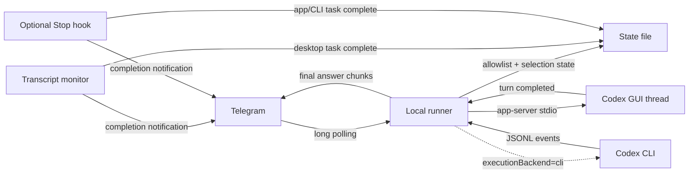

<div align="center">

# Codex Telegram Remote

### Run local Codex jobs from Telegram.

Pick a project with `/select`, use the latest GUI conversation automatically, switch conversations with `/thread`, then type a normal Telegram message.

<p>
  🚀 Run Codex from anywhere with Telegram<br>
  🧭 Tap `/select`, choose a project, then type normally<br>
  🧵 Default to the latest GUI thread, or switch with `/thread`<br>
  🔔 Get final answers and completion pings automatically<br>
  🔒 Keep execution local, allowlisted, and under your Codex settings
</p>

<p>
  <a href="https://github.com/davemessew/codex-telegram-remote/actions/workflows/ci.yml"></a>
  <a href="package.json">= 20.11" src="https://img.shields.io/badge/node-%3E%3D20.11-339933"></a>
  <a href="LICENSE"></a>
  <a href="package.json"></a>
</p>

<p>
  <a href="#quick-start"><strong>Quick Start</strong></a>
  |
  <a href="#commands"><strong>Commands</strong></a>
  |
  <a href="#configuration"><strong>Config</strong></a>
  |
  <a href="#security-model"><strong>Security</strong></a>
  |
  <a href="docs/windows.md"><strong>Windows</strong></a>
  |
  <a href="docs/troubleshooting.md"><strong>Troubleshooting</strong></a>
</p>

</div>

---

Codex Telegram Remote is a local runner plus a Codex plugin. It talks to Telegram through long polling, so there are no public webhooks, no exposed ports, and no cloud worker between Telegram and your machine.

| 🚀 Select | 🧵 Thread | ✍️ Prompt | 🔔 Notify |
| --- | --- | --- | --- |
| Tap `/select` to choose a project. | Use the newest GUI thread or tap `/thread`. | Send normal messages as prompts. | Receive final answers and completion alerts. |

## Demo

```text
You: /select

Bot: Select a project. Current project: frontend.

[ Current: frontend ]
[ api-service       ]
[ docs-site         ]

You: /thread

Bot: Select a thread for frontend.

[ Current: Build dashboard ]
[ Fix auth flow          ]

You: add tests for the project picker

Bot: Job completed
Job: job-ab12cd
Project: frontend

Summary:
Added focused project-picker tests.

Details:
<full Codex final answer>
```

## Features

| Feature | Details |
| --- | --- |
| Tappable project picker | `/select` opens an inline Telegram keyboard with project pagination and the current project highlighted. |
| Tappable thread picker | `/thread` lists existing GUI conversations for the selected project. If you do nothing, the runner uses the most recently updated thread. |
| Normal-message prompts | After a project is selected, non-command messages become Codex prompts in the selected or latest GUI thread. |
| Follow-up replies | If Codex asks a question, reply in Telegram and the runner continues the same thread. |
| Job picker | `/jobs` lists recent jobs with tappable buttons. Selecting one makes `/status` and `/tail` use that job by default. |
| Completion messages | Telegram-launched jobs send completion messages automatically. Desktop completions are watched from local transcripts, and app/CLI completions can also notify through the optional `Stop` hook. |
| Locked-PC support | Windows setup registers a hidden Task Scheduler job that continues while the screen is locked. |
| Conservative access | Only `allowedChatIds` can run jobs. Unknown chats are ignored by default. |

## Commands

```text
/select          choose the active project
/thread          choose the active GUI thread for the selected project
/current         show the selected project and selected thread
/jobs            list and select recent jobs
/status [jobId]  show selected job, current project status, or a specific job
/tail [jobId]    show selected job, current project output, or a specific job
/cancel <jobId>  cancel a running job
/help            show command help
```

## Quick Start

### 1. Create a Telegram bot

Create a bot with [BotFather](https://core.telegram.org/bots/features#botfather), save the token, and find your numeric chat ID.

Detailed steps: [docs/telegram-bot-setup.md](docs/telegram-bot-setup.md)

### 2. Install the plugin

```powershell
codex plugin marketplace add https://github.com/davemessew/codex-telegram-remote
codex plugin add codex-telegram-remote@codex-telegram-remote
```

Local checkout:

```powershell
git clone https://github.com/davemessew/codex-telegram-remote.git
cd codex-telegram-remote
npm install
npm test

codex plugin marketplace add .
codex plugin add codex-telegram-remote@codex-telegram-remote
```

### 3. Run setup on Windows

```powershell
.\plugins\codex-telegram-remote\scripts\setup-windows.ps1 `
  -BotToken "123456789:replace-me" `
  -AllowedChatIds "123456789"
```

Optional default project alias:

```powershell
.\plugins\codex-telegram-remote\scripts\setup-windows.ps1 `
  -BotToken "123456789:replace-me" `
  -AllowedChatIds "123456789" `
  -DefaultProject "frontend" `
  -DefaultProjectPath "C:\code\frontend"
```

### 4. Use Telegram

Send `/select`, tap a project, optionally send `/thread` to pick a conversation, then send a normal message.

Full Windows guide: [docs/windows.md](docs/windows.md)

## Configuration

Default config path:

| Platform | Path |
| --- | --- |
| Windows | `%USERPROFILE%\.codex-telegram-remote\config.json` |
| macOS/Linux | `~/.codex-telegram-remote/config.json` |

Minimal config:

```json
{
  "botToken": "123456789:replace-with-your-bot-token",
  "allowedChatIds": ["123456789"]
}
```

Common config:

```json
{
  "botToken": "123456789:replace-with-your-bot-token",
  "allowedChatIds": ["123456789"],
  "completionChatIds": ["123456789"],
  "defaultProject": "frontend",
  "projectAliases": {
    "frontend": "C:/code/frontend",
    "api-service": "C:/code/api-service"
  },
  "codexBin": "",
  "codexHome": "C:/Users/you/.codex",
  "executionBackend": "appServer",
  "maxConcurrentJobs": 1,
  "sendFullFinalAnswer": true,
  "replyToUnauthorized": false,
  "telegramChunkSize": 3900,
  "pollTimeoutSeconds": 50,
  "projectPageSize": 8,
  "threadPageSize": 8
}
```

### Important options

| Key | Default | Purpose |
| --- | --- | --- |
| `allowedChatIds` | Required | Only these Telegram chats can run Codex. |
| `completionChatIds` | `allowedChatIds` | Chats that receive regular completion notifications. |
| `projectAliases` | `{}` | Friendly project names shown in `/select`. |
| `defaultProject` | Empty | Alias or path selected by default. |
| `codexBin` | Auto-detected | Path to the Codex binary. |
| `executionBackend` | `appServer` | `appServer` routes prompts into existing GUI threads. Set `cli` for the legacy `codex exec` backend. |
| `maxConcurrentJobs` | `1` | Maximum simultaneous Telegram-launched jobs. |
| `projectPageSize` | `8` | Number of projects shown per `/select` page. |
| `threadPageSize` | `8` | Number of GUI threads shown by `/thread`. |
| `sendFullFinalAnswer` | `true` | Include the exact final answer under `Details:`. When `false`, completion messages include status and any explicit summary. |
| `replyToUnauthorized` | `false` | Reply to unknown chats. Keep off except during setup. |

Environment overrides:

```text
CODEX_TELEGRAM_BOT_TOKEN
CODEX_TELEGRAM_ALLOWED_CHAT_IDS
CODEX_TELEGRAM_DEFAULT_PROJECT
CODEX_TELEGRAM_CONFIG
CODEX_TELEGRAM_CONFIG_DIR
CODEX_TELEGRAM_EXECUTION_BACKEND
CODEX_CLI_PATH
CODEX_BIN
CODEX_HOME
```

## How It Works



Project discovery uses:

- `[projects]` from `$CODEX_HOME/config.toml`
- `projectAliases` from this plugin's config

The runner stores selected projects, selected GUI threads, selected jobs, and waiting jobs per Telegram chat. Reply-to mappings are chat-scoped, so one chat cannot resume or cancel another chat's job.

By default, prompts use the selected project's most recently updated GUI thread. Use `/thread` to pin a different existing conversation for that Telegram chat and project. Set `executionBackend` to `cli` only if you prefer the older `codex exec` behavior.

Regular desktop tasks are recorded as completed jobs when the runner sees a local transcript `task_complete` event. App/CLI tasks can also be recorded by the optional `Stop` hook. Completion messages include a `Details:` block with the exact final answer text, a `Select job` button, and the same job appears in `/jobs`.

## Security Model

This project lets Telegram messages trigger local Codex execution. Treat it like remote access to your developer machine.

Safe defaults:

- Unknown Telegram chats are ignored.
- Every executable chat must be listed in `allowedChatIds`.
- State and config files are written with private permissions where the platform supports it.
- Telegram-launched jobs inherit your existing Codex sandbox, approvals, model, auth, and trusted project settings.
- The regular completion hook is opt-in and must be trusted in Codex.
- Hook transcript reads are restricted to the configured Codex home.

Read before publishing or installing for real use:

- [SECURITY.md](SECURITY.md)
- [PRIVACY.md](PRIVACY.md)
- [TERMS.md](TERMS.md)

## Platform Support

| Platform | Status | Notes |
| --- | --- | --- |
| Windows 10/11 | Primary | Setup creates a hidden Task Scheduler job at user logon. |
| macOS | Supported | Setup creates a user LaunchAgent. |
| Linux | Runner is portable | No packaged service installer yet. |

Locked Windows sessions work when the user remains logged in, the machine is awake, networking is available, and Codex does not need an interactive desktop approval prompt.

## Documentation

| Topic | Link |
| --- | --- |
| Telegram bot setup | [docs/telegram-bot-setup.md](docs/telegram-bot-setup.md) |
| Windows setup | [docs/windows.md](docs/windows.md) |
| macOS setup | [docs/macos.md](docs/macos.md) |
| Troubleshooting | [docs/troubleshooting.md](docs/troubleshooting.md) |
| Uninstall | [docs/uninstall.md](docs/uninstall.md) |
| Publishing | [docs/publishing.md](docs/publishing.md) |

## Development

```powershell
npm install
npm test
npm audit --omit=dev
```

The project uses Node's built-in test runner and has no runtime npm dependencies.

Useful validation:

```powershell
Get-ChildItem -Recurse -Filter *.mjs | ForEach-Object { node --check $_.FullName }
```

## Repository Layout

```text
plugins/codex-telegram-remote/
  .codex-plugin/plugin.json       plugin metadata
  hooks/hooks.json                optional Stop hook
  scripts/runner.mjs              Telegram long-poll runner
  scripts/lib/                    runner modules
  scripts/setup-windows.ps1       Windows setup
  scripts/setup-macos.sh          macOS setup
  examples/config.example.json    config template
  skills/                         plugin skill
docs/                             setup and operations docs
tests/                            unit and integration-style tests
```

## Contributing

Issues and pull requests are welcome. Keep changes focused, add tests for behavior changes, and do not commit bot tokens, chat IDs, transcripts, or local machine paths.

Security reports should follow [SECURITY.md](SECURITY.md).

## License

MIT. See [LICENSE](LICENSE).
