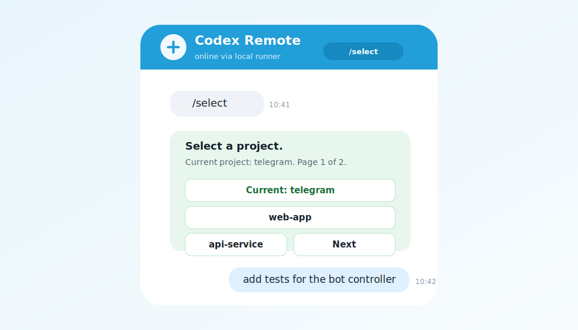
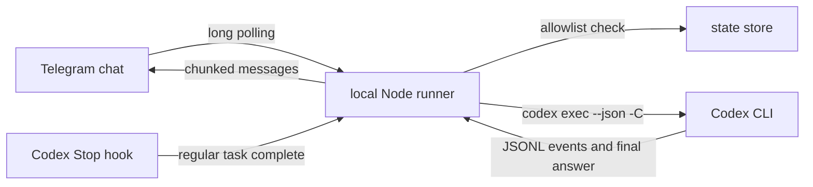

# Codex Telegram Remote

[](package.json)
[](LICENSE)
[](package.json)
[](#platform-support)

Run Codex from Telegram with a tappable project picker, normal-message prompts, remote job continuation, and completion notifications when Codex finishes.

Codex Telegram Remote is a Codex plugin plus a local always-on Telegram runner. It uses Telegram long polling, so you do not need a public webhook URL, a reverse proxy, or an exposed port. On Windows it can keep running from Task Scheduler while the PC is locked, as long as the user is logged in, the machine is awake, and networking is available.



## What You Get

- `/select` opens a tappable Telegram project overview.
- Tap a project once, then send normal Telegram messages as Codex prompts for that project.
- Reply in Telegram when Codex asks a follow-up question.
- Receive full final Codex answers in Telegram, chunked safely for Telegram limits.
- Receive completion notifications for normal Codex app and CLI tasks through the bundled opt-in `Stop` hook.
- Restrict all execution to explicit Telegram chat IDs.
- Inherit your existing Codex model, sandbox, approvals, trusted project settings, and authentication.
- Run on a locked Windows PC via a hidden Task Scheduler job.

## Safety Notice

This bot turns Telegram messages into local Codex execution on your machine. Treat it like remote access to your development environment.

The defaults are intentionally conservative: only allowlisted chats can run commands, unknown chats are ignored, config/state files are written with private permissions, Telegram-launched jobs are scoped to the chat that started them, and regular Codex completion hooks require explicit Codex trust.

Read [SECURITY.md](SECURITY.md) and [PRIVACY.md](PRIVACY.md) before publishing, installing, or sharing a configured bot.

## Quick Start: Windows

Requirements:

- Windows 10 or 11.
- Codex installed and logged in.
- Node.js 20.11 or newer.
- A Telegram bot token from BotFather.
- Your numeric Telegram chat ID.

Install from a published marketplace repository:

```powershell
codex plugin marketplace add https://github.com/davemessew/codex-telegram-remote
codex plugin add codex-telegram-remote@codex-telegram-remote
```

Or install from a local checkout:

```powershell
git clone https://github.com/davemessew/codex-telegram-remote.git
cd codex-telegram-remote
npm install
npm test

codex plugin marketplace add .
codex plugin add codex-telegram-remote@codex-telegram-remote
```

Run setup:

```powershell
.\plugins\codex-telegram-remote\scripts\setup-windows.ps1 `
  -BotToken "123456789:replace-me" `
  -AllowedChatIds "123456789"
```

Optional friendly default project:

```powershell
.\plugins\codex-telegram-remote\scripts\setup-windows.ps1 `
  -BotToken "123456789:replace-me" `
  -AllowedChatIds "123456789" `
  -DefaultProject "telegram" `
  -DefaultProjectPath "C:\Users\you\Documents\Telegram"
```

Then open Telegram:

```text
/select
```

Tap a project. After that, any normal non-command message in the allowed chat becomes a Codex prompt for the selected project.

Full Windows setup, locked-screen notes, and troubleshooting are in [docs/windows.md](docs/windows.md).

## Telegram Commands

| Command | What it does |
| --- | --- |
| `/select` | Open the tappable project picker. |
| `/select text` | Filter projects by name or path before showing the picker. |
| `/current` | Show the selected project for this Telegram chat. |
| `/jobs` | List recent jobs for this Telegram chat. |
| `/status [jobId]` | Show job status. Uses the most recent job when omitted. |
| `/tail [jobId]` | Show the latest captured Codex output. |
| `/cancel <jobId>` | Cancel a running job owned by this Telegram chat. |
| `/help` | Show command help. |

Normal text messages run prompts only after a project is selected. If no project is selected, the bot shows `/select` instead of running anything.

When Codex asks for input, reply to the bot's question in Telegram or send the next normal message in the same chat. The runner resumes the waiting Codex thread with `codex exec resume`.

## How It Works



The runner stays local. Telegram talks only to Telegram's Bot API, and Codex execution happens on your machine under your existing Codex configuration.

## Project Discovery

Projects come from two sources:

- Codex config `[projects]` entries in `$CODEX_HOME/config.toml`.
- Friendly aliases in this plugin's `projectAliases` config.

Aliases are shown first and are useful when a project path is long:

```json
{
  "projectAliases": {
    "telegram": "C:/Users/you/Documents/Telegram",
    "backend": "D:/work/company/backend"
  },
  "defaultProject": "telegram"
}
```

The picker shows the current project, supports pagination, and preserves filters while moving between pages.

## Configuration

Default config paths:

- Windows: `%USERPROFILE%\.codex-telegram-remote\config.json`
- macOS/Linux: `~/.codex-telegram-remote/config.json`

Minimal config:

```json
{
  "botToken": "123456789:replace-with-your-bot-token",
  "allowedChatIds": ["123456789"]
}
```

Full example:

```json
{
  "botToken": "123456789:replace-with-your-bot-token",
  "allowedChatIds": ["123456789"],
  "completionChatIds": ["123456789"],
  "defaultProject": "telegram",
  "projectAliases": {
    "telegram": "C:/Users/you/Documents/Telegram"
  },
  "codexBin": "",
  "codexHome": "C:/Users/you/.codex",
  "maxConcurrentJobs": 1,
  "sendFullFinalAnswer": true,
  "replyToUnauthorized": false,
  "telegramChunkSize": 3900,
  "pollTimeoutSeconds": 50,
  "projectPageSize": 8
}
```

| Key | Default | Purpose |
| --- | --- | --- |
| `botToken` | Required | Telegram bot token from BotFather. Can be supplied with `CODEX_TELEGRAM_BOT_TOKEN`. |
| `allowedChatIds` | Required | Telegram chats allowed to run Codex. Can be supplied with `CODEX_TELEGRAM_ALLOWED_CHAT_IDS`. |
| `completionChatIds` | `allowedChatIds` | Chats that receive regular Codex `Stop` hook notifications. |
| `defaultProject` | Empty | Project alias or path selected by default. Can be supplied with `CODEX_TELEGRAM_DEFAULT_PROJECT`. |
| `projectAliases` | `{}` | Friendly names mapped to local project paths. |
| `codexBin` | Auto-detected | Path to the Codex binary. Can be supplied with `CODEX_CLI_PATH` or `CODEX_BIN`. |
| `codexHome` | `~/.codex` | Codex config and transcript directory. Can be supplied with `CODEX_HOME`. |
| `maxConcurrentJobs` | `1` | Maximum simultaneous Telegram-launched Codex jobs. |
| `sendFullFinalAnswer` | `true` | Send final answer text instead of only job status. |
| `replyToUnauthorized` | `false` | Reply to unknown chats. Keep this off except during chat ID setup. |
| `telegramChunkSize` | `3900` | Message chunk size, kept below Telegram's 4096-character limit. |
| `pollTimeoutSeconds` | `50` | Telegram long-poll timeout. |
| `projectPageSize` | `8` | Projects shown per picker page. |

Environment variables:

- `CODEX_TELEGRAM_BOT_TOKEN`
- `CODEX_TELEGRAM_ALLOWED_CHAT_IDS`
- `CODEX_TELEGRAM_DEFAULT_PROJECT`
- `CODEX_TELEGRAM_CONFIG`
- `CODEX_TELEGRAM_CONFIG_DIR`
- `CODEX_CLI_PATH` or `CODEX_BIN`
- `CODEX_HOME`

## Completion Notifications

Telegram-launched jobs notify automatically through the runner.

Regular Codex app and CLI tasks notify through the bundled `Stop` hook. Codex plugin hooks are opt-in:

```toml
[features]
plugin_hooks = true
```

After enabling plugin hooks, open Codex and review `/hooks`. Trust the Codex Telegram Remote `Stop` hook only after reading the hook command. The hook suppresses duplicate notifications for jobs launched from Telegram.

## Platform Support

| Platform | Status | Runner |
| --- | --- | --- |
| Windows 10/11 | Primary support | Hidden Task Scheduler job at user logon. |
| macOS | Supported setup script | LaunchAgent in `~/Library/LaunchAgents`. |
| Linux | Runner code is portable | No packaged service installer yet. |

### Locked Windows PCs

The Windows scheduled task continues after the screen is locked if:

- The user remains logged in.
- The machine is awake.
- Networking remains available.
- Codex does not require an interactive desktop approval prompt.

For reliable remote use, disable sleep while plugged in and choose Codex approval settings that make sense for unattended work.

## macOS Setup

```bash
BOT_TOKEN="123456789:replace-me" \
ALLOWED_CHAT_IDS="123456789" \
./plugins/codex-telegram-remote/scripts/setup-macos.sh
```

The macOS setup uses `umask 077`, validates the Telegram token, writes private config files, and installs a user LaunchAgent. See [docs/macos.md](docs/macos.md).

## Repository Layout

```text
plugins/codex-telegram-remote/
  .codex-plugin/plugin.json       Codex plugin metadata
  hooks/hooks.json                Opt-in Stop hook
  scripts/runner.mjs              Telegram long-poll runner
  scripts/lib/                    Runner, config, state, Telegram, and Codex modules
  scripts/setup-windows.ps1       Windows installer
  scripts/setup-macos.sh          macOS installer
  examples/config.example.json    Config template
  skills/                         Plugin skill docs for Codex
docs/                             Setup, publishing, uninstall, and troubleshooting docs
tests/                            Node test suite with fake Telegram and fake Codex processes
```

## Development

```powershell
npm.cmd install
npm.cmd test
npm.cmd audit --omit=dev
```

Syntax checks used during release validation:

```powershell
Get-ChildItem -Recurse -Filter *.mjs | ForEach-Object { node --check $_.FullName }
```

The project intentionally has no runtime npm dependencies.

## Publishing Checklist

Before publishing a GitHub release:

- Run the full test suite.
- Run `npm audit --omit=dev`.
- Verify `setup-windows.ps1` with a real Telegram bot token and chat ID.
- Confirm the runner works after locking the Windows session.
- Smoke-test `codex exec --json -C <project>` with the discovered Codex binary.
- Review [SECURITY.md](SECURITY.md), [PRIVACY.md](PRIVACY.md), and [TERMS.md](TERMS.md).
- Confirm repository links point to the intended GitHub owner before tagging a release.

Detailed publishing notes are in [docs/publishing.md](docs/publishing.md).

## Troubleshooting

Common issues are covered in [docs/troubleshooting.md](docs/troubleshooting.md):

- Windows Store `codex.exe` access denied.
- PowerShell blocking `npm.ps1`.
- Bot does not respond.
- No projects appear in `/select`.
- Hook notifications do not fire.
- Locked PC stops responding.

## License

MIT. See [LICENSE](LICENSE).
